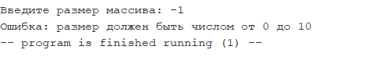
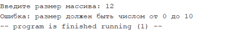
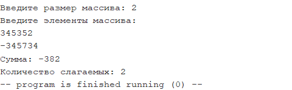
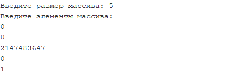
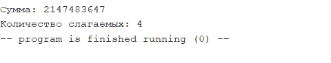
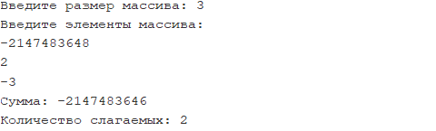
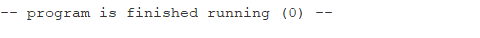

# ДЗ5

**Внимание:** эмулятор *RARS* работает с файлами кодировки *cp1251*, которая некорректно отображается в браузере. Скриптом *convert_encoding.py* файлы были перекодированы в *utf-8*, результат лежит в папке *utf8*.

## Запуск

Компиляция производилась со флагом "Initialize program counter to global 'main' if defined" (и никакими другими) 

## Код

Основная программа: "hw5.asm"

## Тесты

 

---

 

---

 

---

 

 

---

 

 

